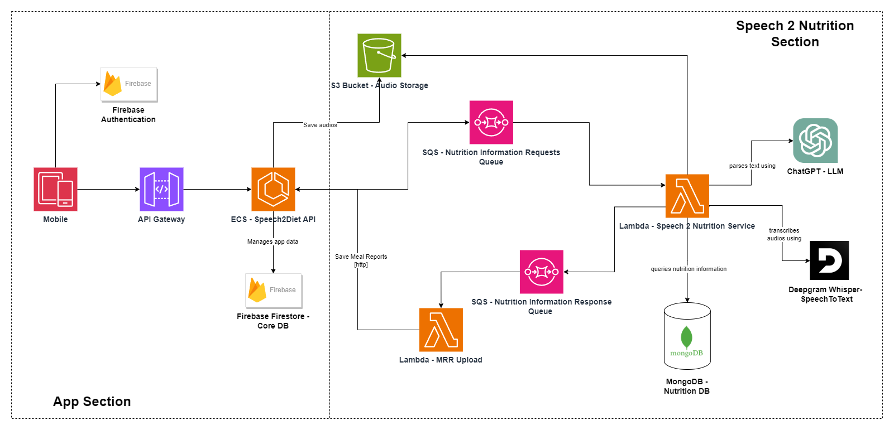

# FitVoice / Speech2Diet

FitVoice, formally known as speech2diet, is an application that allows people to track their food intake by recording what they eat throughout the day. The fundamental workflow is:

- Open the app. 
- Click on the record icon. 
- Describe what you are eating using your voice.
- After a while, you can see in the app the description of the meal you have eaten with its nutritional information.

_Note: This a mono repo containing all the necessary services for the app’s backend._
_Note2: I am still working on the project and improving the documentation for all the services._

## AWS Infrastructure Diagram

