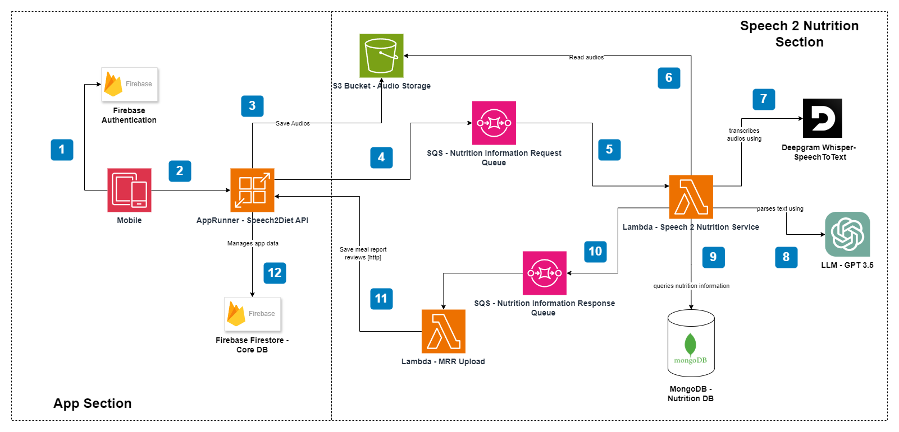

# FitVoice / Speech2Diet

FitVoice, formally known as speech2diet, is an application that allows people to track their food intake by recording what they eat throughout the day. The fundamental workflow is:

- Open the app. 
- Click on the record icon. 
- Describe what you are eating using your voice.
- After a while, you will see in the app the list of foods you have consumed in your meal with their nutritional information.

_Note: This is a mono repo containing all the necessary services for the app’s backend._

_Note2: I am still working on the project and improving the documentation for all the services._

## Terminology

**Abbreviations:**

Some abbreviations are used in the documentation and code to avoid long names.

_mrr:_  meal report review
_frr:_ food report review
_s2n:_ Speech 2 Nutrition
_s2d-api:_ Speech 2 Diet API

**¿What are meal report reviews?**

To keep it simple, it's just a report containing all the foods you consumed in a meal that the user must review. Remember, these reports are system generated, and the review process is necessary to fix possible errors. [The data model](https://github.com/dgop92/speech2diet/blob/main/s2d-api/src/features/foodlog/entities/meal-report-review.ts)

## AWS Infrastructure Diagram

**App section:**

- API Gateway: Handle security, monitoring, and rate limits to prevent abuse of internal services.
- ECS - Speech 2 Diet API: Manage profile user data and meal report reviews. 
- Firebase Authentication: Handle user authentication.
- Firestore: NoSQL database to store profile user data and meal report reviews.

**Speech 2 Nutrition Section:**

- S3 Bucket - Audio Storage: Store user voice recordings.
- SQS - Nutrition Information Request Queue: Queue for nutrition information request messages. 
- SQS - Nutrition Information Request Queue: Queue for nutrition information response messages. 
- Lambda - Speech 2 Nutrition: Handle nutrition information request messages by transforming audio recordings into a structured list of foods. 
- GPT 3.5: LLM for extracting the food names, descriptions, quantities, and units from a text fragment.
- Deepgram Whisper: Service for transcribing audio to text. 
- MongoDB - Nutrition DB: NoSQL database to store food nutritional information. It currently uses USDA foundation foods as its main source of data.
- Lambda - MRR Upload: make HTTP requests to Speech 2 Diet API to upload meal report reviews.

### Architectural decisions

**¿Why this architecture?**.

First, the architecture is a mix of event-driven architecture with microservices. This decision can be explained with the following bullet points:

* There is a clear difference between s2d-api and s2n. s2n is a pipeline of different components with a unique responsibility, “transforming audio recordings into a structured list of foods”. On the other hand, s2d-api is an API to manage the app’s data. 
* Using a microservices architecture enables the utilization of various programming languages. s2n takes advantage of the Python ecosystem for natural language processing libraries to apply text cleaning and processing. Additionally, if we stick to a single language, we may encounter performance issues, considering that NodeJS is not well-suited for CPU-intensive tasks.
* The service decoupling provided by the event-driven architecture is useful for adding new services with ease. The above is required if we consider adding a notification system.
* The retry mechanism for messages is convenient for handling unexpected errors caused by external services. In s2n, for example, if a message fails to be processed because the GPT 3.5 API was down, the message is not lost and is sent back to the queue again.

**¿Why Firebase?**

The main reason I used Firebase is because I was already familiar with the services. I am planning in the future to migrate to AWS DynamoDB and add AWS Cognito.

**¿Why MongoDB?**

Same answer as above. Nevertheless, the positive aspect of the project is that clean architecture principles are applied in different parts of the project, which makes the migration to another NoSQL document database easy.

### Main Libraries / Languages / Frameworks

**Speech 2 Diet API:**

- NodeJS
- Typescript
- NestJS

**Speech 2 Nutrition:**

- Python
- GPT 3.5 API
- Deepgram Whisper API
- Spacy

**MRR Upload:**

- NodeJS
- Typescript
- NestJS

For more information about the libraries used in the project, please check the package.json or requirements.txt files.