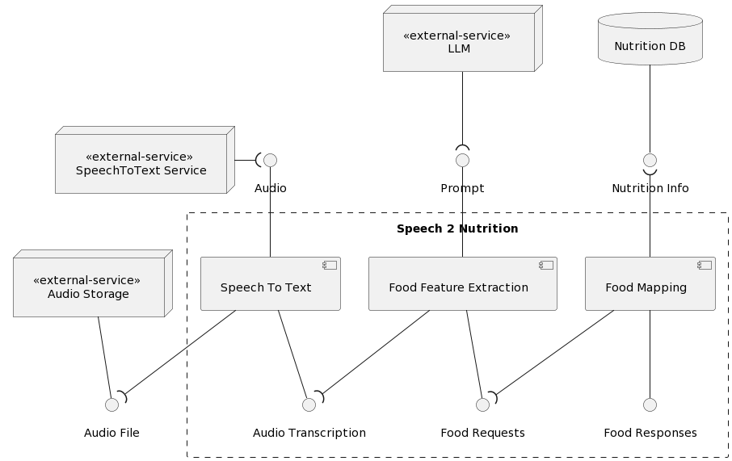

# Speech 2 Nutrition

## Overview

The core of FitVoice is the service "Speech 2 Nutrition". Its responsibility is to convert an audio description of a meal into a structured list of foods with their nutritional information.



When a message is received, the initial processing responsibility falls on the "Speech 2 Text" component. This component retrieves the audio from the storage service and then proceeds to transcribe the content. After obtaining a precise transcription of the audio, it is passed on to the second component, known as "Food Feature Extraction." This component harnesses the power of large language models (LLMs) to extract names, descriptions, quantities, and units for each food mentioned in the audio transcript. Now, with the structured list of foods containing the user's food intake, the system moves to the third and last component "Food Mapping". In this phase, it looks for the best matching foods based on the user report in the nutritional database.

## Setup

1. It is recommend to use Python 3.10.9

2. Create a virtual environment:

```bash
python -m venv venv
```

3. Activate the virtual environment:

```bash
source venv/bin/activate
```

You can also activate the virtual environment using VSCode. Just select the Python interpreter in the bottom left corner.

4. Install the dependencies:

```bash
pip install -r requirements.txt
```

5. Create a `.env` file following the `.env.example` file

## Tests

- Unit tests: tests that are deterministic and can be run in any machine.

```bash
pytest -v
```

- Food extraction service: To get the component performance metrics, run the following command.

```bash
python -m tests.food_extraction.execute_performance_metrics
```

Unit tests cannot be write for this component because the results are not completely deterministic as its using LLMs.

A folder in `tests/data/fe_results` will be created with the results of the performance metrics for each test set. Test sets are located in `tests/food_extraction/test_sets`

## How to run

You can execute this service in different ways:

Using the `main.py` will create a consumer that will listen to a queue and process the messages. It's up to you to decide with the environment variable `MESSAGE_QUEUE_SERVICE` whether to use AWS SQS or RabbitMQ

```bash
python main.py
```

Or using the Dockerfile

```bash
docker build -t speech2nutrition .
docker run --env-file .env speech2nutrition
```

You can also use a lambda function with the `lambda_function.py` file

To test it locally you can use docker

```bash
docker build -f Dockerfile.lambda -t speech2nutrition .
docker run --env-file .env speech2nutrition
```

## Extras

### Request example

```json
{
  "user_id": "user-test",
  "audio_id": "audio-meals/audio-test-2.mp3",
  "db_lookup_preference": "system-db",
  "meal_recorded_at": "2023-12-15T00:00:00"
}
```

### Response example

```json
{
  "raw_transcript": "hoy almorcé 100 gramos de arroz con 80 gramos de carne",
  "food_responses": [
    {
      "food_record": {
        "food": {
          "id": "2512380",
          "food_name": "arroz",
          "other_names": [],
          "description": ["integral", "grano largo", "sin enriquecer", "crudo"],
          "full_description": [
            "arroz",
            "integral",
            "grano",
            "enriquecer",
            "crudo"
          ],
          "portion_reference": 100,
          "portion_unit": "g",
          "food_source": "system_db",
          "calories": 366,
          "protein": 7,
          "fat": 3,
          "carbohydrates": 76
        },
        "score": 2.0,
        "amount": 100,
        "unit_was_transformed": true
      },
      "suggestions": [
        {
          "food": {
            "id": "2512381",
            "food_name": "arroz",
            "other_names": [],
            "description": ["blanco", "grano largo", "sin enriquecer", "crudo"],
            "full_description": [
              "arroz",
              "blanco",
              "grano",
              "enriquecer",
              "crudo"
            ],
            "portion_reference": 100,
            "portion_unit": "g",
            "food_source": "system_db",
            "calories": 359,
            "protein": 7,
            "fat": 1,
            "carbohydrates": 80
          },
          "score": 2.0,
          "amount": 100,
          "unit_was_transformed": true
        }
      ],
      "user_amount": 100,
      "user_unit": "gramos"
    },
    {
      "food_record": {
        "food": {
          "id": "746761",
          "food_name": "carne de vacuno",
          "other_names": ["carne de res", "carne de vaca"],
          "description": [
            "redondo",
            "asado",
            "deshuesado",
            "magro separable",
            "recortado a 0 de grasa",
            "selecto",
            "crudo"
          ],
          "full_description": [
            "carne vacuno",
            "carne res",
            "carne vaca",
            "redondo",
            "asado",
            "deshuesado",
            "magro separable",
            "recortado 0 grasa",
            "selecto",
            "crudo"
          ],
          "portion_reference": 100,
          "portion_unit": "g",
          "food_source": "system_db",
          "calories": 116,
          "protein": 23,
          "fat": 2,
          "carbohydrates": 0
        },
        "score": 2.0,
        "amount": 80,
        "unit_was_transformed": true
      },
      "suggestions": [
        {
          "food": {
            "id": "746758",
            "food_name": "carne de vaca",
            "other_names": ["carne de res", "carne de vaca"],
            "description": [
              "lomo",
              "asado de lomo",
              "magro separable",
              "deshuesado",
              "recortado a 0 grasa",
              "selecto",
              "cocido",
              "asado"
            ],
            "full_description": [
              "carne vaca",
              "carne res",
              "carne vaca",
              "lomo",
              "asado lomo",
              "magro separable",
              "deshuesado",
              "recortado 0 grasa",
              "selecto",
              "cocido",
              "asado"
            ],
            "portion_reference": 100,
            "portion_unit": "g",
            "food_source": "system_db",
            "calories": 168,
            "protein": 27,
            "fat": 6,
            "carbohydrates": 0
          },
          "score": 2.0,
          "amount": 80,
          "unit_was_transformed": true
        },
        {
          "food": {
            "id": "746763",
            "food_name": "carne de vacuno",
            "other_names": ["carne de res", "carne de vaca"],
            "description": [
              "lomo corto",
              "chulet\u00f3n de buey",
              "con hueso",
              "s\u00f3lo magro separable",
              "recortado a 1/8 de grasa",
              "selecci\u00f3n",
              "cocido",
              "a la parrilla"
            ],
            "full_description": [
              "carne vacuno",
              "carne res",
              "carne vaca",
              "lomo corto",
              "chulet\u00f3n buey",
              "hueso",
              "magro separable",
              "recortado 1/8 grasa",
              "selecci\u00f3n",
              "cocido",
              "parrilla"
            ],
            "portion_reference": 100,
            "portion_unit": "g",
            "food_source": "system_db",
            "calories": 212,
            "protein": 27,
            "fat": 11,
            "carbohydrates": 0
          },
          "score": 2.0,
          "amount": 80,
          "unit_was_transformed": true
        },
        {
          "food": {
            "id": "2514744",
            "food_name": "carne de vacuno",
            "other_names": ["carne de res"],
            "description": ["molida", "80% carne magra / 20% grasa", "crudo"],
            "full_description": [
              "carne vacuno",
              "carne res",
              "molida",
              "80% carne magra 20% grasa",
              "crudo"
            ],
            "portion_reference": 100,
            "portion_unit": "g",
            "food_source": "system_db",
            "calories": 243,
            "protein": 17,
            "fat": 19,
            "carbohydrates": 0
          },
          "score": 2.0,
          "amount": 80,
          "unit_was_transformed": true
        }
      ],
      "user_amount": 80,
      "user_unit": "gramos"
    }
  ],
  "food_requests": [
    {
      "food_name": "arroz",
      "description": [],
      "amount": 100,
      "unit": "gramos"
    },
    {
      "food_name": "carne",
      "description": [],
      "amount": 80,
      "unit": "gramos"
    }
  ],
  "ni_request": {
    "user_id": "user-test",
    "audio_id": "audio-meals/audio-test-2.mp3",
    "db_lookup_preference": "system-db",
    "meal_recorded_at": "2023-12-15T00:00:00"
  }
}
```
